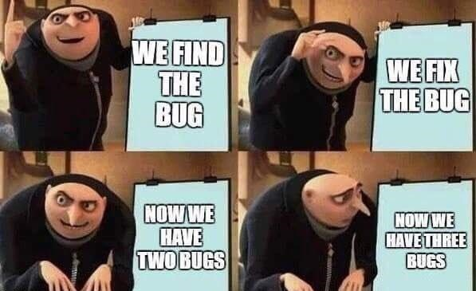

## What is Software Engineering?
Contrary to many people's beliefs, software engineering is not just learning how to code and building software.  A big part of software engineering is also <i>how</i> to build software efficiently and streamline the engineering process as much as possible.  Thus, being a good software engineer requires that you have a good grasp on the principles and concepts that guide software engineering as a whole.  Below are some of the most important concepts that I believe make up the discipline of software engineering.

## Agile Project Management
In an ideal world, a project could be completed sequentially by planning the requirements, buildng the project, testing for bugs, and deploying the final product.  The team would never have to worry about it again and move on to the next project.  However, in reality, this approach often does not work.  Customer and client needs are constantly changing and business conditions are always evolving.  Something that works one day may not work another day, and sotware engineers need to be ready for this.  To solve this problem, Agile Project Management was introduced.  It's a framework that emphasizes smaller, iterative cycles that always focus on the current needs of the project.  One style of Agile Project Management is called Issue Driven Project Management.  In this version, the current requirements or <i>issues</i> of the project are listed out and dictate the priority of what needs to be done.  By implementing this methodology, software engineers ensure that they are always working on the most up-to-date issues and minimize time spent on outdated or non-urgent tasks.

## Design Patterns
Imagine you have a project that involves building the same type of thing over and over again.  Is it smart to start each project from scratch and treat them as independent from each other?  Of course not.  A more reasonable way to approach this type of project would be to craft some sort of blueprint that can be reused for each iteration.  In this way, repetitive work is minimized and you will have more time to think about other aspects of the project.  This is the principle behind Design Patterns.  At first glance, this may seem "lazy", but I prefer to use the word "efficient".  After all, there's no point in doing extra work that reaps no benefit.  If you'd like to read more about my opinions on Design Patterns, check out my other essay [here](./how-to-be-lazy.html).

## Software Engineering Ethics
Suppose you are a lawyer.  You've just finished meeting with a client and have gone over some very personal details about the case.  Is it acceptable to go on social media and post about these details?  Or perhaps you're an investment advisor who earns a nice comission on any stock you sell.  Can you sell an overpriced stock that your company believes will go bankrupt in the near future?  In both cases, the answer is no because not only does it break some serious laws, it is also a clear violation of ethics.  The lawyer has a duty to the client to keep information confidential, and the investment advisor has a duty to act in the client's best interest.

Professional software engineers also must adhere to a code of ethics and avoid doing things that harm others for personal gain.  For example, perhaps a website you have designed secretly collects some sensitive data about users.  Furthermore, this data violates privacy standards and could easily be exploited by selling it to third parties.  Although there is an attractive money making opportunity here, professionals must conduct themselves with high ethical standards and should not even collect this data in the first place.  No matter what the profession, ethics are always of utmost importance, and especially in this age of big data and technology, ethics for software engineers are becoming more and more crucial.
