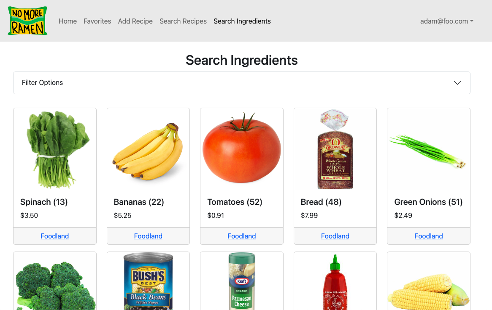
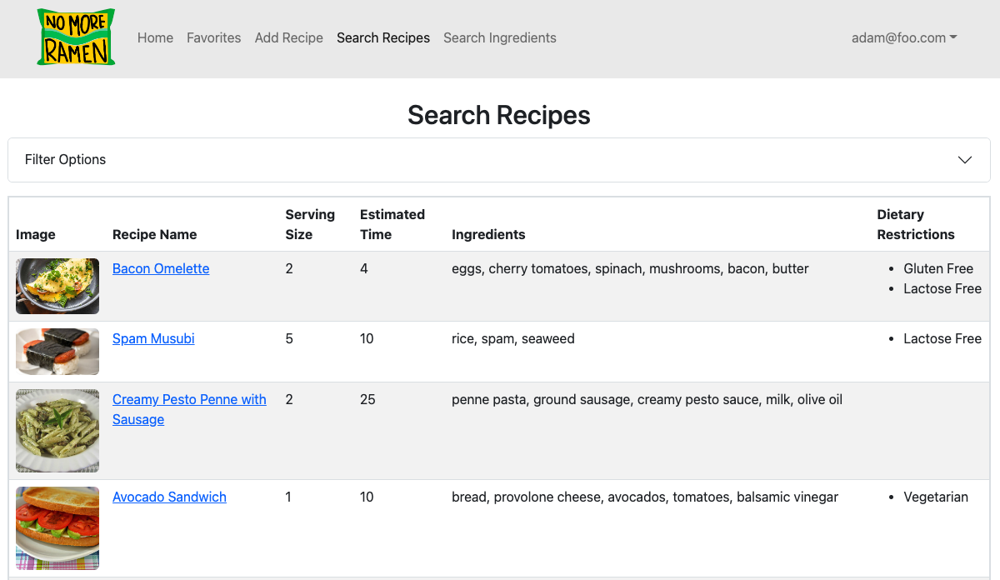
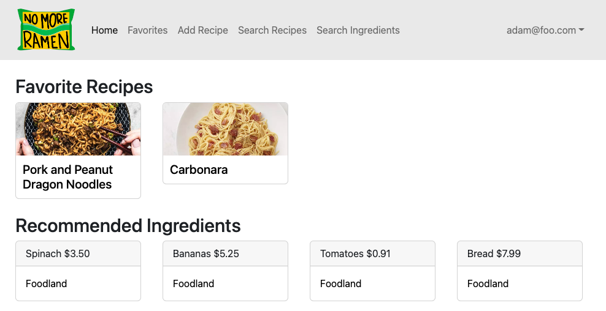

College students are often low on cash and have limited experience cooking and preparing meals.  This often leads to students eating meals that are quick to make but are low in nutritional content.  This can affect their focus, energy, and quality of academic studying.

This project was created as a way for:
  1) Students to share recipes with each other
  2) Vendors to advertise their ingredients with students

As a student, you can upload recipes and list the required ingredients.  As a vendor, you can upload ingredients that you carry and indicate the price and number in stock.  Then, as students browse through recipes, they can look through the ingredients list and see which vendors carry the necessary ingredients as well as the prices.

My contribution to this project was creating an individual recipe page that displayed a photo, ingredients, and instructions.  I also implemented a way for students to quickly look up where ingredients were available at by simply hovering over each ingredient.  I also created the vendor home page, where each vendor sees a list of ingredients they have uploaded, the prices, and quantity available.

I learned a lot about the integegration of the front-end of a website and the back-end.  On the front-end, I had to design an easy-to-use UI that accepted data from the user and sent it to the server.  On the backend, I used MongoDB to store recipe and ingredient data, and sent it to the front-end whenever necessary.

Snapshots of the application are below:

Source: <a href="https://no-more-ramen.github.io/"><i class="large github icon "></i>no-more-ramen</a>
