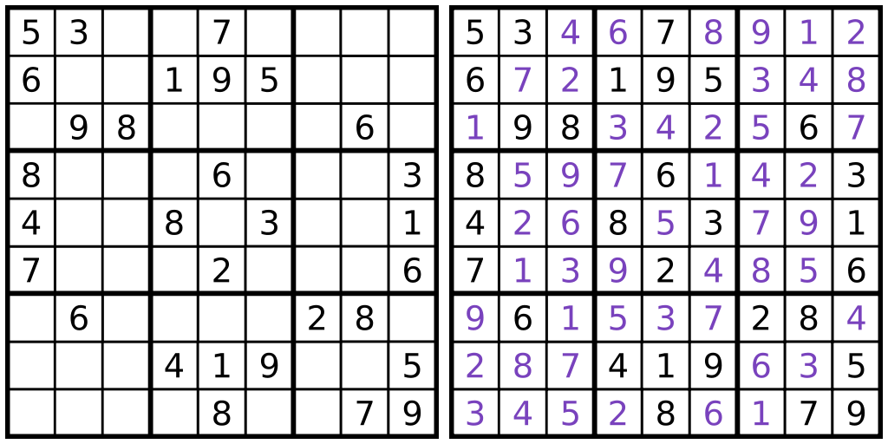

This program uses recursion to solve any Sudoku puzzle by brute force. The primary motivation for this project was to apply recursion in some practical way.  I have also always enjoyed puzzles, so creating a Sudoku solver seemed like the perfect project.  The puzzle starts at the first empty cell and begins to try all possible numbers 1-9. If a number is valid, it moves on to the next cell. If the program hits a dead end (no valid numbers can be entered in a cell), it will backtrack to the previous cell, increment the number, and try again.  Once a solution is found, the completed puzzle is printed.

Although inefficient, this program taught me a lot about recursion and its ability to elegantly solve certain problems.  In particular, it was able to solve a very difficult puzzle (one that might normally take someone a few hours) in only a few seconds using relatively few lines of code.

Source: <a href="https://github.com/junkim1519/sudokuSolver"><i class="large github icon "></i>junkim1519/sudokuSolver</a>
